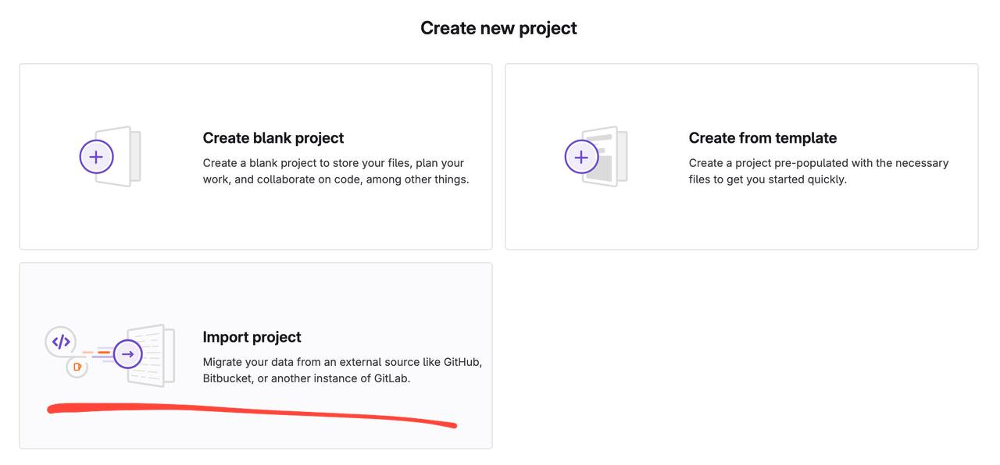
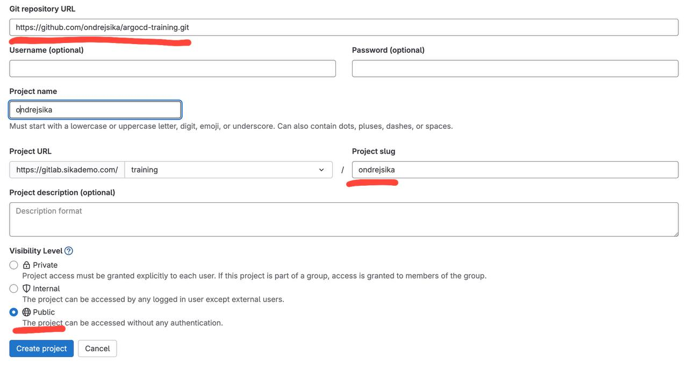

[Ondrej Sika (sika.io)](https://sika.io) | <ondrej@sika.io> | [go to course ->](#course) | [join slack](https://sika.link/slack-sikapublic), [open slack](https://sikapublic.slack.com) | [join.sika.io](https://join.sika.io) | [__Školení ArgoCD__](https://ondrej-sika.cz/skoleni/argocd/) 🚀💻

# ArgoCD Training

## About Course

- [ArgoCD Training in Czech Republic & Slovakia](https://ondrej-sika.cz/skoleni/argocd?_s=ghe)
- [ArgoCD Training in Europe](https://ondrej-sika.com/training/argocd?_s=gh)

### Related Courses

Kubernetes

- [Kubernetes Training in Czech Republic & Slovakia](https://ondrej-sika.cz/skoleni/kubernetes?_s=ghe)
- [Kubernetes Training in Europe](https://ondrej-sika.com/training/kubernetes?_s=gh)

Docker

- [Docker Training in Czech Republic & Slovakia](https://ondrej-sika.cz/skoleni/docker?_s=ghe)
- [Docker Training in Europe](https://ondrej-sika.com/training/docker?_s=gh)

## Chat

For sharing links & "secrets".

- Zoom Chat, Microsoft Teams or Google Meet Chat
- Slack - https://sikapublic.slack.com/
- https://sika.link/chat (tlk.io)

## About Me - [Ondrej Sika](https://sika.io)

**Freelance DevOps Engineer, Consultant & Lecturer**

- Complete DevOps Pipeline
- Open Source / Linux Stack
- Cloud & On-Premise
- Technologies: Git, Gitlab, Gitlab CI, Docker, Kubernetes, Terraform, Prometheus, ELK / EFK, Rancher, Proxmox, DigitalOcean, AWS

## Course

Example ArgoCD Instance from ArgoCD team <https://cd.apps.argoproj.io/>.

## Setup Local Kubernetes Cluster

Create local Kubernetes cluster using [k3d](https://k3d.io/).

```
k3d cluster create training \
  --k3s-arg "--disable=traefik@server:0" \
  --servers 1 --agents 1 \
  --port "80:80@loadbalancer" \
  --port "443:443@loadbalancer" \
  --wait
```

Install ingress-nginx

```
helm upgrade --install \
	ingress-nginx ingress-nginx \
	--repo https://kubernetes.github.io/ingress-nginx \
	--create-namespace \
	--namespace ingress-nginx \
	--set controller.service.type=ClusterIP \
	--set controller.ingressClassResource.default=true \
	--set controller.kind=DaemonSet \
	--set controller.hostPort.enabled=true \
	--set controller.metrics.enabled=true \
	--set controller.config.use-proxy-protocol=false \
	--wait
```

Install cert-manager

```
helm upgrade --install \
  cert-manager cert-manager \
  --repo https://charts.jetstack.io \
  --create-namespace \
  --namespace cert-manager \
  --set crds.enabled=true \
  --wait
```

## Install Let's Encrypt Issuer

```
kubectl apply -f https://raw.githubusercontent.com/ondrejsika/kubernetes-training/refs/heads/master/clusterissuer-letsencrypt.yml
```

## Connect the Lab

Go to `https://codeX.sikademo.com` where X is your lab number (e.g. `https://code53.sikademo.com`).

The password will be provided during the training.

## Login to Gitlab

Go to https://gitlab.sikademo.com with credentials:

- username: `demo-user`
- password: `asdfasdf`

Import this training repository from Github to group `training` in demo Gitlab with your name (using Git).

Go to https://gitlab.sikademo.com/training anc click on **New project**.


Choose **Import project** and then **Git**.



Enter the URL of this repository: `https://github.com/ondrejsika/argocd-training.git` rename it to `yourname` anc click on **Create project**.



## Install ArgoCD

Install ArgoCD

```
helm upgrade --install \
  argocd argo-cd \
  --repo https://argoproj.github.io/argo-helm \
  --create-namespace \
  --namespace argocd \
  --values argocd.values.yml \
  --wait
```

Get `admin` initial password

```
kubectl -n argocd get secret argocd-initial-admin-secret -o jsonpath="{.data.password}" | base64 -d && echo
```

Using [slu](https://github.com/sikalabs/slu)

```
slu argocd initial-password
```

Copy to pasteboard (Mac)

```
slu argocd initial-password | pbcopy
```

See

<https://argocd.k8s.sikademo.com>

## Install ArgoCD with SSO

Create `argocd.sso.values.yml`

```
cp argocd.sso.values.EXAMPLE.yml argocd.sso.values.yml
```

Install

```
make install-argocd-with-sso
```

## Create basic ArgoCD App

Declarative

```
kubectl apply -f examples/apps/manifests_v1.yml
```

## Create ArgoCD App from own repository

Fork [ondrejsika/argocd-training](https://github.com/ondrjsika/argocd-training) to Gitlab.

## Manual Sync

Make changes to your repository ([gitlab.sikademo.com/ondrejsika/argocd-training](https://gitlab.sikademo.com/ondrejsika/argocd-training)) and see if ArgoCD propagate those changes to cluster.

Update repo path

```
kubectl apply -f examples/apps/manifests_gitlab_v1.yml
```

You can click **refresh** to fetch new repo version.

Nothing is updated, you can see diff of current state and desired state.

If you want to apply those new changes, you have to click **sync**.

## Create Namespace

ArgoCD don't create namespace for application by default. You have to specify syncOptions `CreateNamespace=true`:

```yaml
spec:
  # ...
  syncPolicy:
    syncOptions:
      - CreateNamespace=true
```

## Automatic Sync and Prune

You have to enable automatic sync and prunning by:

```yaml
spec:
  # ...
  syncPolicy:
    automated:
      prune: true
      selfHeal: true
```

## Source Directory

Docs: [Directory](https://argo-cd.readthedocs.io/en/stable/user-guide/directory/)

Recursive source directory, useful for app-of-apps pattern

```yaml
spec:
  # ...
  source:
    directory:
      recurse: true
```

Exclude specific files, useful for `values.yaml` for Helm

Docs: [Directory / Excluding Certain Files](https://argo-cd.readthedocs.io/en/stable/user-guide/directory/#excluding-certain-files)

```yaml
spec:
  source:
    directory:
      exclude: '{**/manifests/**,**/Chart.yaml,**/values.y*ml,**/*.values.y*ml,**/templates/**}'
```

Include only specific files

```yaml
spec:
  # ...
  source:
    directory:
      include: 'kubernetes/*'
```

## Delete resources after delete App

Add finalizer:

```yaml
metadata:
  # ...
  finalizers:
    - resources-finalizer.argocd.argoproj.io
```

Try it

```
kubectl apply -f examples/apps/manifests_v2.yml
```

or

```
kubectl apply -f examples/apps/manifests_gitlab_v2.yml
```

## ArgoCD App with Helm

Helm package from Git repo

```
kubectl apply -f examples/helm_from_git.yml
```

Helm package from Helm repo

```
kubectl apply -f examples/helm_from_package.yml
```

You can also install Helm without any specific helm configuration

```
kubectl apply -f examples/helm_with_dependencies.yml
```

## Private Repositories

HTTPS

```
kubectl apply -f examples/repos/repo-https.yml
```
SSH

```
kubectl apply -f examples/repos/repo-https.yml
```

## Own SSH known hosts

Get keys using `ssh-keyscan`

```
ssh-keyscan gitlab.sikademo.com
```

Add to `configmap` `argocd-ssh-known-hosts-cm` in `argocd` namespace.

```
kubectl patch -n argocd configmap argocd-ssh-known-hosts-cm --patch-file examples/argocd-ssh-known-hosts-cm-patch.yml
```

## App of Apps

App of Apps is global ArgoCD app which is created manually in the cluster and manages all others ArgoCD Apps using ArgoCD

```
kubectl apply -f examples/app_of_apps/app_of_apps.yml
```

or

```
kubectl apply -f https://raw.githubusercontent.com/ondrejsika/argocd-training/master/examples/app_of_apps/app_of_apps.yml
```

## Sync Hooks

[Resource Hooks Docs](https://argo-cd.readthedocs.io/en/stable/user-guide/resource_hooks/)

Example with pre & post sync hooks.

```
kubectl apply -f examples/sync_hooks/app.yaml
```

## Sync Waves

Example of sync waves

```
kubectl apply -f examples/sync_waves/app_of_apps.yml
```

## ArgoCD App Projects

```
kubectl apply -f examples/appproj/appproj_foo.yml
kubectl apply -f examples/appproj/appproj_bar.yml
```

## Sync Window

We can specify SyncWindow at AppProject by:

```yaml
spec:
  syncWindows:
  - applications:
    - '*'
    duration: 10m
    kind: allow
    schedule: 0 * * * *
    timeZone: UTC
```

Try:

```
kubectl apply -f examples/appproj/app_bar.yml
```

## Application Set

Application Set is a way how to create multiple ArgoCD Apps from one template.

```
kubectl apply -f examples/appset.yml
```

## Multiple Sources

- https://github.com/ondrejsika/argocd-apps-values-in-files-example

## ArgoCD Image Updater

- Docs - https://argocd-image-updater.readthedocs.io/en/stable/
- Github - https://github.com/argoproj-labs/argocd-image-updater

### Install

```
kubectl apply -n argocd -f https://raw.githubusercontent.com/argoproj-labs/argocd-image-updater/stable/manifests/install.yaml
```

### Public Example

```
kubectl apply -f examples/image_updater/helm_public.yml
```

### Private Example

Allow Image Updater to access secrets in all namespaces

```
kubectl apply -f examples/argocd_image_updater_read_secrets_in_all_namespaces.yml
```

Apply the example

```
kubectl apply -f examples/image_updater/helm_private.yml
```


### slu CLI

Get Initial `admin` password

```
slu argocd initial-password
```

```
slu acd ip
```

```
slu acd ip | pbcopy
```

Get / Open ArgoCD URL

```
slu argocd get
```

```
slu argocd open
```

Reset `admin` password

```
slu argocd password-reset
```

```
slu acd pr
```

Port forward to ArgoCD without Ingress

```
slu argocd port-forward
```

```
slu acd pf
```

## Thank you! & Questions?

That's it. Do you have any questions? **Let's go for a beer!**

### Ondrej Sika

- email: <ondrej@sika.io>
- web: <https://sika.io>
- twitter: [@ondrejsika](https://twitter.com/ondrejsika)
- linkedin: [/in/ondrejsika/](https://linkedin.com/in/ondrejsika/)
- Newsletter, Slack, Facebook & Linkedin Groups: <https://join.sika.io>

_Do you like the course? Write me recommendation on Twitter (with handle `@ondrejsika`) and LinkedIn (add me [/in/ondrejsika](https://www.linkedin.com/in/ondrejsika/) and I'll send you request for recommendation). **Thanks**._

Wanna to go for a beer or do some work together? Just [book me](https://book-me.sika.io) :)

## Past Training Sessions

### 2025-05-26

- ArgoCD Apps Monorepo - https://github.com/sika-training-examples/2025-05-26-argocd-apps-example
- My changes in this repo (not so nice) - https://github.com/sika-training-examples/2025-05-26_ondrejsika-argocd-training

### 2024-09-17

- My changes in this repo - https://github.com/sika-training-examples/2024-09-17_ondrej-argocd-training
- ArgoCD Apps Monorepo - https://github.com/sika-training-examples/2024-09-17_argocd_apps_example

### 2023-12-01

- Repositories
  - My changes in this repo - https://github.com/sika-training-examples/2024-04-22-argocd-training-ondrejsika
  - ArgoCD Apps - https://github.com/sika-training-examples/2024-02-22-argocd-apps
  - Example project with Gitlab CI pipeline - https://github.com/sika-training-examples/2024-04-22-argocd-example-pipeline

- Repositories from gitlab.sikademo.com
  - example/os - https://github.com/sika-training-examples/2023-12-01_argocd_training_ondrejsika
  - example/1 - https://github.com/sika-training-examples/2023-12-01_argocd_training_1
  - example/2 - https://github.com/sika-training-examples/2023-12-01_argocd_training_2
  - example/3 - https://github.com/sika-training-examples/2023-12-01_argocd_training_3

## My Notes

Replace README of training repo with link to this repo

```
curl -o README.md https://raw.githubusercontent.com/ondrejsikax/banners-for-training/refs/heads/master/banners/argocd.md
echo "" >> README.md
echo '# !!! This is not an original ArgoCD Training repo. This repo has many changes from past training session. If you want to see an original ArgoCD training repo, please go to [ondrejsika/argocd-training](https://github.com/ondrejsika/argocd-training)' >> README.md
git add README.md
git commit -m "Replace README with link to original repo"
```
